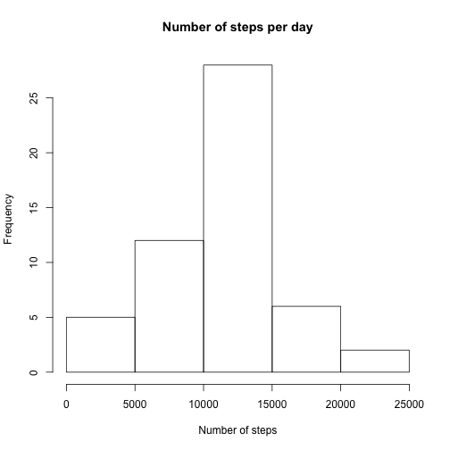
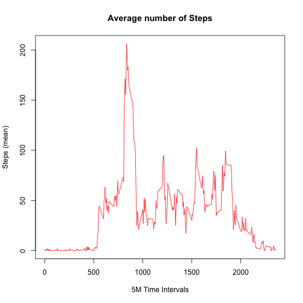
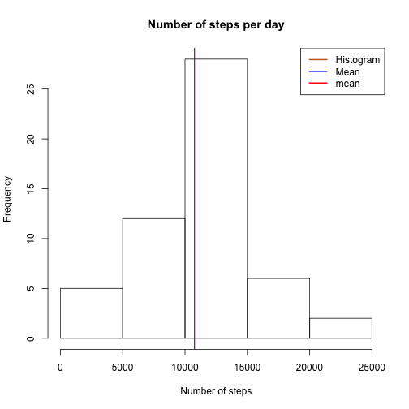
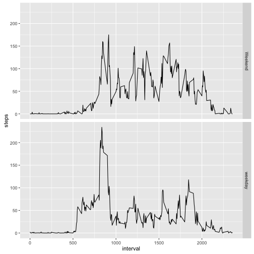

For this assignment we'll use some external packages:


```r
library(dplyr)
library(ggplot2)
```

## 1. Loading and preprocessing the data

The following code loads the CSV file from working directory into Data Frame.
We the convert character-stored dates to R class "Date"


```r
        setwd("~/Dropbox/_MyProjects/Data Science/Reproducible research/Peer review assingment")
        activ <- read.csv("activity.csv")
        activ$date <- as.Date(as.character(activ$date))
        head(activ)
```

```
##   steps       date interval
## 1    NA 2012-10-01        0
## 2    NA 2012-10-01        5
## 3    NA 2012-10-01       10
## 4    NA 2012-10-01       15
## 5    NA 2012-10-01       20
## 6    NA 2012-10-01       25
```

##2. What is mean total number of steps taken per day?

For this part of the assignment, we'll ignore the missing values in the dataset.

1. Calculate the total number of steps taken per day


```r
    A1  <- summarise(group_by(activ, date), stepscount = sum(steps))
```

The result is tibble data frame


```r
    head(A1)
```

```
## # A tibble: 6 x 2
##         date stepscount
##       <date>      <int>
## 1 2012-10-01         NA
## 2 2012-10-02        126
## 3 2012-10-03      11352
## 4 2012-10-04      12116
## 5 2012-10-05      13294
## 6 2012-10-06      15420
```

2. Make a histogram of the total number of steps taken each day


```r
        hist(A1$stepscount , main="Number of steps per day", xlab="Number of steps")
```


        
3. Calculate and report the mean and median of the total number of steps taken per day


```r
        mean(A1$stepscount, na.rm=TRUE)
```

```
## [1] 10766.19
```

```r
        median(A1$stepscount, na.rm=TRUE)
```

```
## [1] 10765
```


##3. What is the average daily activity pattern?

Make a time series plot (i.e. type="l") of the 5-minute interval (x-axis) and the average number of steps taken, averaged across all days (y-axis)

Aggregating data:


```r
stepsmean <- tapply(activ$steps, activ$interval, mean, na.rm = TRUE)
head(stepsmean)
```

```
##         0         5        10        15        20        25 
## 1.7169811 0.3396226 0.1320755 0.1509434 0.0754717 2.0943396
```

Plotting data:




Which 5-minute interval, on average across all the days in the dataset, contains the maximum number of steps?


```r
        interval_number <- which.max(stepsmean)
        interval_max <- names(interval_number)
        interval_max
```

```
## [1] "835"
```
        
##4. Imputing missing values

The presence of missing days may introduce bias into some calculations or summaries of the data.

Calculate and report the total number of missing values in the dataset (i.e. the total number of rows with NAs)

```r
        sum((!complete.cases(activ)))
```

```
## [1] 2304
```

To fill in the missing values in the dataset we'll use simple mean for all days. 

```r
        meansteps <- mean(activ$steps, na.rm=TRUE)
        meansteps
```

```
## [1] 37.3826
```
 
 
Create a new dataset that is equal to the original dataset but with the missing data filled in.


```r
        ### Imputing missing values by all-days mean value
        meansteps <- mean(activ$steps, na.rm=TRUE) 
        A2 <- activ
        activ_full <- A2 ### Saving imputed dataframe for further purposes
        A2$steps[!complete.cases(activ)] <- meansteps
        sum((!complete.cases(A2)))
```

```
## [1] 0
```

Make a histogram of the total number of steps taken each day


```r
A2  <- summarise(group_by(activ, date), stepscount = sum(steps))
        A2  <- A2[!is.na(A2$stepscount),]
        hist(A2$stepscount , main="Number of steps per day", xlab="Number of steps")
        abline(v=mean(A2$stepscount), col="Red" )
        abline(v=mean(A2$stepscount), col="Blue" )
        legend(x = "topright", # location of legend within plot area
               c("Histogram", "Mean", "mean"),
               col = c("chocolate3", "blue", "red"),
               lwd = c(2, 2, 2))
```



Calculate and report the mean and median total number of steps taken per day. 


```r
       ### Calculating mean and median
        mean(A2$stepscount)
```

```
## [1] 10766.19
```

```r
        median(A2$stepscount)
```

```
## [1] 10765
```

##5. Are there differences in activity patterns between weekdays and weekends?

Using the imputted dataset we create a new factor variable in the dataset with two levels ??? ???weekday??? and ???weekend??? indicating whether a given date is a weekday or weekend day.


```r
        A3 <- activ_full
        A3$day <- "weekday"
        A3$day[weekdays(A3$date)==c("Saturday") | weekdays(A3$date)==c("Sunday") ] <- "Weekend"    
        A3$day <- as.factor(A3$day)
```
        
Make a panel plot containing a time series plot of the 5-minute interval (x-axis) and the average number of steps taken, averaged across all weekday days or weekend days (y-axis). 
        

```r
        meansteps <- aggregate(A3$steps, by = list(A3$interval, A3$day), FUN=mean, na.rm=TRUE)
        names(meansteps) <- c("interval", "day", "steps")
        
        
        ggplot(data=meansteps, aes(x=interval, y=steps)) +
                geom_line() + 
                facet_grid(day~. )
```


        
